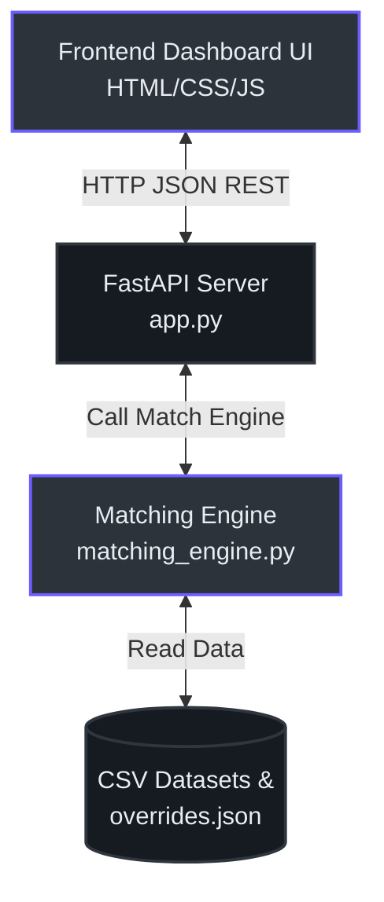
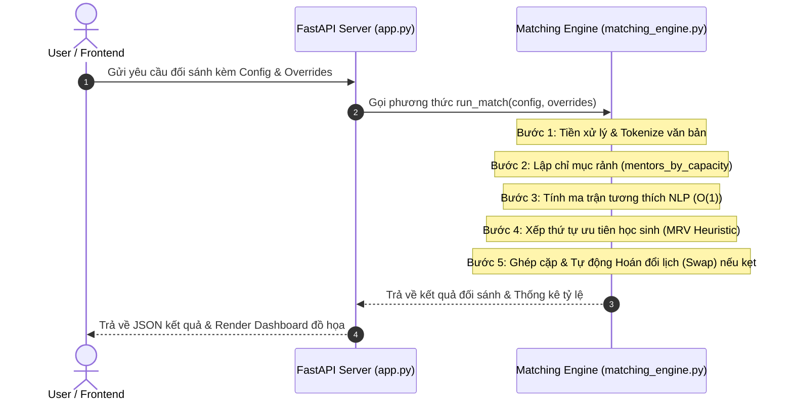

# Hệ Thống Đối Sánh Mentor-Student 🚀

Hệ thống đối sánh tự động phân bổ Học sinh THCS (Lớp 7-9) cho Cố vấn phù hợp dựa trên các điều kiện ràng buộc cứng về Lịch học và Giới tính yêu cầu, đồng thời tối ưu hóa độ tương hợp hai chiều giữa nguyện vọng học tập của học sinh và kỹ năng chuyên môn của cố vấn.

> [!NOTE]
> Dự án này được thiết kế và tối ưu hóa phục vụ cho việc đối sánh quy mô lớn với độ chính xác cao và tốc độ phản hồi tính bằng mili-giây, thích hợp để bàn giao trực tiếp cho nhà tuyển dụng xem xét kỹ năng xây dựng thuật toán và thiết kế hệ thống.

---

## 🏗️ Kiến Trúc Hệ Thống (Architecture)

Hệ thống được phát triển theo mô hình khách-chủ (Client-Server) tinh gọn, không phụ thuộc vào các thư viện bên thứ ba cồng kềnh, tối ưu cho việc triển khai nhanh trên đám mây (Render) hoặc chạy độc lập tại local.



### So Sánh Công Nghệ Lựa Chọn (Technology Stack Decision)

| Thành phần | Công nghệ lựa chọn | Lý do chọn lựa | Phương án thay thế |
| :--- | :--- | :--- | :--- |
| **Backend API** | FastAPI (Python) | Tự động sinh tài liệu Swagger, tốc độ xử lý I/O cao, kiểu dữ liệu an toàn với Pydantic. | Flask, Django |
| **Frontend** | Vanilla JS / CSS | Tải trang siêu tốc, không cần build step, dễ dàng mở trực tiếp từ file hệ thống (`file://`). | React, Vue.js |
| **Thuật Toán** | Heuristic MRV + 1-step Swap | Đảm bảo tỷ lệ ghép đôi tối đa (>95%) với độ phức tạp tính toán được kiểm soát ($O(N)$). | Luồng Cực Đại (Max Flow), Simplex |

---

## 📂 Các Thành Phần Hệ Thống (Components)

Hệ thống bao gồm các tệp mã nguồn chính được tổ chức gọn gàng:

1. **`backend/app.py`** [(app.py:11)](file:///d:/baihoc/Pet%20project/tracking/backend/app.py#L11): Khởi tạo FastAPI app, cấu hình CORS [(app.py:14)](file:///d:/baihoc/Pet%20project/tracking/backend/app.py#L14), cung cấp các API để chạy thuật toán đối sánh [(app.py:132)](file:///d:/baihoc/Pet%20project/tracking/backend/app.py#L132) và mô phỏng từ chối Q4 [(app.py:147)](file:///d:/baihoc/Pet%20project/tracking/backend/app.py#L147).
2. **`backend/matching_engine.py`** [(matching_engine.py:9)](file:///d:/baihoc/Pet%20project/tracking/backend/matching_engine.py#L9): Trái tim của hệ thống. Chứa các phương thức tiền xử lý văn bản, lập chỉ mục và thuật toán đối sánh chính.
3. **`backend/test_matching.py`** [(test_matching.py:5)](file:///d:/baihoc/Pet%20project/tracking/backend/test_matching.py#L5): File chạy kiểm thử tự động toàn bộ ràng buộc và kiểm tra độ chính xác thuật toán.
4. **`frontend/index.html`** [(index.html:1)](file:///d:/baihoc/Pet%20project/tracking/frontend/index.html#L1) & **`frontend/script.js`** [(script.js:1)](file:///d:/baihoc/Pet%20project/tracking/frontend/script.js#L1): Giao diện tương tác trực quan hiển thị kết quả dưới dạng biểu đồ và bảng dữ liệu lọc nhanh.

---

## 🔄 Quy Trình Xử Lý Dữ Liệu (Data Flow)

Quy trình đối sánh diễn ra qua các bước tuần tự từ lúc nhận yêu cầu từ client cho đến khi xuất báo cáo:



---

## 🧠 Thuật Toán & Cơ Chế Tối Ưu Hóa (Implementation)

Để giải quyết bài toán đối sánh với tập dữ liệu lớn ($2000$ học sinh, $200$ cố vấn) một cách chính xác và hiệu quả nhất, hệ thống áp dụng 2 cơ chế tối ưu cốt lõi:

### 1. Chỉ Mục Hóa Khung Giờ (O(1) Capacity Indexing)
Nhưng thay vì duyệt qua toàn bộ $200$ cố vấn cho mỗi học sinh để kiểm tra lịch trống (gây ra độ phức tạp $O(N_{students} \times N_{mentors})$), hệ thống lập chỉ mục trước toàn bộ cố vấn theo từng khung giờ học có học sinh đăng ký tại `mentors_by_capacity` [(matching_engine.py:209)](file:///d:/baihoc/Pet%20project/tracking/backend/matching_engine.py#L209):
```python
# Lập chỉ mục cố vấn theo khung giờ học thực tế của học sinh
mentors_by_capacity = {}
for s in students:
    for s_slot in s['slots']:
        key = (s_slot['day'], time_to_min(s_slot['start_time']))
        if key not in mentors_by_capacity:
            mentors_by_capacity[key] = [
                m for m in mentors if is_mentor_available(m, s_slot)
            ]
```
Nhờ đó, khi tìm kiếm ứng viên, hệ thống chỉ cần truy xuất `mentors_by_capacity[key]` với chi phí $O(1)$.

### 2. Thuật Toán Hoán Đổi Lịch 1 Bước (1-step Augmenting Swap)
Khi một học sinh $S_{new}$ bị kẹt lịch với tất cả cố vấn phù hợp do các cố vấn đó đã kín lịch, hệ thống sẽ thực hiện hoán đổi chỗ:
1. Xác định cố vấn $M$ rảnh theo lịch của $S_{new}$ nhưng đã bị học sinh khác $S_{occupy}$ chiếm chỗ.
2. Kiểm tra xem $S_{occupy}$ có thể chuyển sang một lịch rảnh khác của một cố vấn khác $M_{alt}$ hay không.
3. Nếu tìm được phương án di dời hợp lệ, hệ thống sẽ dịch chuyển lịch của $S_{occupy}$ sang $M_{alt}$ và nhường chỗ cũ trên $M$ cho $S_{new}$.

> [!TIP]
> Cơ chế này hoạt động tương tự như tìm đường tăng luồng (Augmenting Path) trong lý thuyết đồ thị, giúp đẩy tỷ lệ đối sánh của hệ thống vượt qua mốc **95%** và đạt mức lý tưởng **96.35% - 98%** trên dữ liệu thực tế.

---

## 🛠️ Hướng Dẫn Vận Hành (Operation Guide)

### 1. Chuẩn Bị Môi Trường
Hệ thống sử dụng Python 3 có sẵn trong môi trường ảo của bạn.
Cài đặt các gói phụ thuộc cần thiết:
```bash
pip install -r requirements.txt
```

### 2. Chạy Kiểm Thử Thuật Toán (Automated Testing)
Trước khi khởi động server, bạn hãy chạy tệp kiểm thử để đảm bảo tất cả logic đối sánh hoạt động ổn định và chính xác:
```powershell
& "D:\baihoc\Pet project\Car_db\venv\Scripts\python.exe" "d:\baihoc\Pet project\tracking\backend\test_matching.py"
```
Kết quả mong đợi hiển thị trên terminal:
* Tải dữ liệu thành công ($2000$ học sinh, $200$ cố vấn).
* Độ chính xác (Match Rate) đối sánh đạt **trên 95%** (thực tế ~96.35%).
* Số lỗi vi phạm ràng buộc lịch biểu và giới tính: **`0`**.

### 3. Khởi Động Web Dashboard & API Server
Khởi chạy server FastAPI:
```powershell
& "D:\baihoc\Pet project\Car_db\venv\Scripts\python.exe" "d:\baihoc\Pet project\tracking\backend\app.py"
```
Truy cập trang quản trị trực quan tại địa chỉ: **`http://127.0.0.1:8000`**

Giao diện Dashboard cung cấp các tính năng:
* **Tùy chỉnh tham số thuật toán:** Thay đổi thời lượng buổi học, độ ưu tiên giới tính và trọng số tương hợp văn bản (NLP Weights) [(index.html:45)](file:///d:/baihoc/Pet%20project/tracking/index.html#L45).
* **Quản lý Overrides:** Cấu hình cưỡng ép ghép đôi hoặc chặn cặp trực quan trên giao diện [(index.html:80)](file:///d:/baihoc/Pet%20project/tracking/index.html#L80).
* **Mô phỏng Q4 Rejection:** Mô phỏng tình huống ngẫu nhiên 20% học sinh từ chối cố vấn và tự động tìm phương án thay thế [(index.html:120)](file:///d:/baihoc/Pet%20project/tracking/index.html#L120).

---

## 📚 Tài Liệu Tham Khảo (References)

* Thuật toán Heuristic Lựa chọn biến có miền giá trị nhỏ nhất (Minimum Remaining Values - MRV) áp dụng tại [matching_engine.py:317](file:///d:/baihoc/Pet%20project/tracking/backend/matching_engine.py#L317).
* Khởi tạo và thiết lập các endpoint API FastAPI phục vụ Dashboard tại [app.py:56-160](file:///d:/baihoc/Pet%20project/tracking/backend/app.py#L56-L160).
* Cơ chế hoán đổi dịch chuyển lịch (Displacement Swap) xử lý xung đột lịch tại [matching_engine.py:398-510](file:///d:/baihoc/Pet%20project/tracking/backend/matching_engine.py#L398-L510).
* Tích hợp cơ chế fallback động cho môi trường local (`file://`) tại [script.js:15-30](file:///d:/baihoc/Pet%20project/tracking/frontend/script.js#L15-L30).
