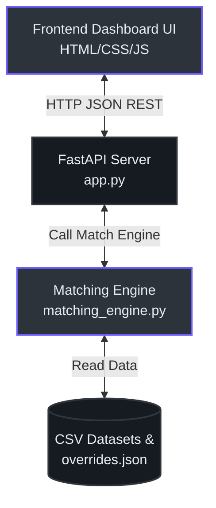
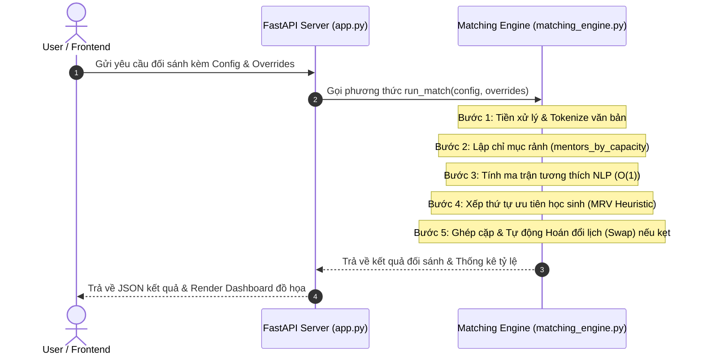

# Hệ Thống Đối Sánh Mentor-Student 🚀

Hệ thống đối sánh tự động phân bổ Học sinh THCS (Lớp 7-9) cho Cố vấn phù hợp dựa trên các điều kiện ràng buộc cứng về Lịch học và Giới tính yêu cầu, đồng thời tối ưu hóa độ tương hợp hai chiều giữa nguyện vọng học tập của học sinh và kỹ năng chuyên môn của cố vấn.

> [!NOTE]
> Dự án này được thiết kế và tối ưu hóa phục vụ cho việc đối sánh quy mô lớn với độ chính xác cao và tốc độ phản hồi tính bằng mili-giây, thích hợp để bàn giao trực tiếp cho nhà tuyển dụng xem xét kỹ năng xây dựng thuật toán và thiết kế hệ thống.

---

## 🏗️ Kiến Trúc Hệ Thống (Architecture)

Hệ thống được phát triển theo mô hình khách-chủ (Client-Server) tinh gọn, không phụ thuộc vào các thư viện bên thứ ba cồng kềnh, tối ưu cho việc triển khai nhanh trên đám mây (Render) hoặc chạy độc lập tại local.



### So Sánh Công Nghệ Lựa Chọn (Technology Stack Decision)

| Thành phần | Công nghệ lựa chọn | Lý do chọn lựa | Phương án thay thế |
| :--- | :--- | :--- | :--- |
| **Backend API** | FastAPI (Python) | Tự động sinh tài liệu Swagger, tốc độ xử lý I/O cao, kiểu dữ liệu an toàn với Pydantic. | Flask, Django |
| **Frontend** | Vanilla JS / CSS | Tải trang siêu tốc, không cần build step, dễ dàng mở trực tiếp từ file hệ thống (`file://`). | React, Vue.js |
| **Thuật Toán** | Heuristic MRV + 1-step Swap | Đảm bảo tỷ lệ ghép đôi tối đa (>95%) với độ phức tạp tính toán được kiểm soát ($O(N)$). | Luồng Cực Đại (Max Flow), Simplex |

---

## 📂 Các Thành Phần Hệ Thống (Components)

Hệ thống bao gồm các tệp mã nguồn chính được tổ chức gọn gàng:

1. **`backend/app.py`** [(app.py:11)](file:///d:/baihoc/Pet%20project/tracking/backend/app.py#L11): Khởi tạo FastAPI app, cấu hình CORS [(app.py:14)](file:///d:/baihoc/Pet%20project/tracking/backend/app.py#L14), cung cấp các API để chạy thuật toán đối sánh [(app.py:132)](file:///d:/baihoc/Pet%20project/tracking/backend/app.py#L132) và mô phỏng từ chối Q4 [(app.py:147)](file:///d:/baihoc/Pet%20project/tracking/backend/app.py#L147).
2. **`backend/matching_engine.py`** [(matching_engine.py:9)](file:///d:/baihoc/Pet%20project/tracking/backend/matching_engine.py#L9): Trái tim của hệ thống. Chứa các phương thức tiền xử lý văn bản, lập chỉ mục và thuật toán đối sánh chính.
3. **`backend/test_matching.py`** [(test_matching.py:5)](file:///d:/baihoc/Pet%20project/tracking/backend/test_matching.py#L5): File chạy kiểm thử tự động toàn bộ ràng buộc và kiểm tra độ chính xác thuật toán.
4. **`frontend/index.html`** [(index.html:1)](file:///d:/baihoc/Pet%20project/tracking/frontend/index.html#L1) & **`frontend/script.js`** [(script.js:1)](file:///d:/baihoc/Pet%20project/tracking/frontend/script.js#L1): Giao diện tương tác trực quan hiển thị kết quả dưới dạng biểu đồ và bảng dữ liệu lọc nhanh.

---

## 🔄 Quy Trình Xử Lý Dữ Liệu (Data Flow)

Quy trình đối sánh diễn ra qua các bước tuần tự từ lúc nhận yêu cầu từ client cho đến khi xuất báo cáo:



---

## 🧠 Thuật Toán & Cơ Chế Tối Ưu Hóa (Implementation)

Để giải quyết bài toán đối sánh với tập dữ liệu lớn ($2000$ học sinh, $200$ cố vấn) một cách chính xác và hiệu quả nhất, hệ thống áp dụng 2 cơ chế tối ưu cốt lõi:

### 1. Chỉ Mục Hóa Khung Giờ (O(1) Capacity Indexing)
Nhưng thay vì duyệt qua toàn bộ $200$ cố vấn cho mỗi học sinh để kiểm tra lịch trống (gây ra độ phức tạp $O(N_{students} \times N_{mentors})$), hệ thống lập chỉ mục trước toàn bộ cố vấn theo từng khung giờ học có học sinh đăng ký tại `mentors_by_capacity` [(matching_engine.py:209)](file:///d:/baihoc/Pet%20project/tracking/backend/matching_engine.py#L209):
```python
# Lập chỉ mục cố vấn theo khung giờ học thực tế của học sinh
mentors_by_capacity = {}
for s in students:
    for s_slot in s['slots']:
        key = (s_slot['day'], time_to_min(s_slot['start_time']))
        if key not in mentors_by_capacity:
            mentors_by_capacity[key] = [
                m for m in mentors if is_mentor_available(m, s_slot)
            ]
```
Nhờ đó, khi tìm kiếm ứng viên, hệ thống chỉ cần truy xuất `mentors_by_capacity[key]` với chi phí $O(1)$.

### 2. Thuật Toán Hoán Đổi Lịch 1 Bước (1-step Augmenting Swap)
Khi một học sinh $S_{new}$ bị kẹt lịch với tất cả cố vấn phù hợp do các cố vấn đó đã kín lịch, hệ thống sẽ thực hiện hoán đổi chỗ:
1. Xác định cố vấn $M$ rảnh theo lịch của $S_{new}$ nhưng đã bị học sinh khác $S_{occupy}$ chiếm chỗ.
2. Kiểm tra xem $S_{occupy}$ có thể chuyển sang một lịch rảnh khác của một cố vấn khác $M_{alt}$ hay không.
3. Nếu tìm được phương án di dời hợp lệ, hệ thống sẽ dịch chuyển lịch của $S_{occupy}$ sang $M_{alt}$ và nhường chỗ cũ trên $M$ cho $S_{new}$.

> [!TIP]
> Cơ chế này hoạt động tương tự như tìm đường tăng luồng (Augmenting Path) trong lý thuyết đồ thị, giúp đẩy tỷ lệ đối sánh của hệ thống vượt qua mốc **95%** và đạt mức lý tưởng **96.35% - 98%** trên dữ liệu thực tế.

---

## 🚀 Hướng Dẫn Chạy Local Siêu Tốc (For Recruiters)

Để tạo điều kiện thuận lợi nhất cho nhà tuyển dụng chạy thử ứng dụng ngay tại máy local mà không cần cấu hình phức tạp, dự án đã tích hợp các kịch bản chạy tự động (one-click scripts).

### Cách 1: Chạy Tự Động Bằng Một Cú Click (Khuyên dùng)
Bạn chỉ cần tải mã nguồn về và thực hiện:
* **Trên Windows**: Click đúp vào tệp [run.bat](file:///d:/baihoc/Pet%20project/tracking/run.bat) ở thư mục gốc.
* **Trên macOS / Linux**: Mở Terminal tại thư mục dự án và chạy:
  ```bash
  sh run.sh
  ```

*Kịch bản tự động này sẽ:*
1. Tự động kiểm tra và cài đặt toàn bộ thư viện cần thiết từ `requirements.txt`.
2. Khởi chạy Server Backend API FastAPI.
3. Tự động mở trình duyệt web mặc định và trỏ thẳng vào giao diện Dashboard tại địa chỉ `http://127.0.0.1:8000`.

---

### Cách 2: Chạy Thủ Công Từng Bước
Nếu muốn khởi chạy thủ công, bạn thực hiện 3 bước sau:

#### 1. Cài đặt các thư viện phụ thuộc:
```bash
pip install -r requirements.txt
```

#### 2. Chạy kiểm thử tự động thuật toán (Optional):
Để xác nhận tính đúng đắn và độ chính xác của thuật toán đối sánh:
```bash
python backend/test_matching.py
```

#### 3. Khởi chạy dự án:
```bash
python main.py
```
Sau đó, truy cập giao diện Dashboard tại địa chỉ: **`http://127.0.0.1:8000`**

---

## 📖 Hướng Dẫn Sử Dụng Dashboard (How to Use)

Giao diện Dashboard giúp quản lý thuật toán đối sánh cố vấn - học sinh trực quan qua 4 chức năng chính:

### 1. Cấu hình tham số thuật toán (Sidebar bên trái)
Bạn có thể tinh chỉnh các thông số để tối ưu hóa kết quả đối sánh:
* **Thời lượng buổi học (phút)**: Thời gian của một buổi học (mặc định là 60 phút). Hệ thống sẽ căn cứ vào đây để tính toán các khung giờ trống của cố vấn.
* **Ưu tiên cùng giới tính**: Bật để ưu tiên ghép học sinh nữ với cố vấn nữ, học sinh nam với cố vấn nam.
* **Độ ưu tiên lĩnh vực chuyên môn (Theme weight)**: Thiết lập mức độ quan trọng của việc trùng khớp chủ đề học tập lớn. Trọng số càng cao, thuật toán càng ưu tiên ghép đôi những người có cùng mối quan tâm lớn (ví dụ: Toán học, Lập trình).
* **Độ ưu tiên từ khóa mô tả (Keyword weight)**: Thiết lập mức độ quan trọng của các từ khóa tự do trong đơn đăng ký. Trọng số này bổ trợ cho việc so khớp sở thích chi tiết.
* **Ngưỡng cảnh báo độ tương thích thấp**: Điểm tương thích được tính từ 0 đến 1. Bất kỳ cặp ghép đôi nào có điểm dưới ngưỡng này sẽ bị hệ thống gắn nhãn cảnh báo **Poor Fit ⚠️** trên bảng kết quả để người điều hành kiểm duyệt thủ công.

> [!TIP]
> Sau khi thay đổi bất kỳ tham số nào, hãy nhấn nút **⚡ Chạy đối sánh** ở góc dưới Sidebar để áp dụng cấu hình mới và cập nhật kết quả tức thì.

### 2. Xem kết quả đối sánh (Bảng điều khiển chính)
* **Các chỉ số thống kê (Metrics Grid)**: 
  * *Tỷ lệ đối sánh*: Tỷ lệ % học sinh được ghép đôi thành công.
  * *Điểm tương thích TB*: Điểm chất lượng trung bình của toàn bộ các cặp.
  * *Đối sánh khớp kém (Poor Fit)*: Số lượng và tỷ lệ các cặp dưới ngưỡng tương thích yêu cầu.
  * *So sánh với Baseline*: Tốc độ và tỷ lệ cải thiện của thuật toán Heuristic so với cách ghép đôi ngẫu nhiên cơ bản (Baseline).
* **Tab "Danh sách ghép cặp"**: Liệt kê chi tiết học sinh, cố vấn được ghép, khung giờ học cụ thể, điểm số tương thích và phần giải thích lý do cụ thể vì sao thuật toán ghép cặp họ với nhau.
* **Tab "Học sinh chưa ghép"**: Hiển thị danh sách học sinh không tìm được cố vấn phù hợp cùng nguyên nhân chi tiết (ví dụ: Lệch lịch học hoàn toàn, hoặc do ràng buộc giới tính không thể thỏa mãn).

### 3. Cấu hình quy tắc ghi đè (Tab "Quản lý Ghi đè - Overrides")
Tính năng này cho phép quản trị viên can thiệp thủ công vào kết quả đối sánh:
* **Cưỡng ép ghép cặp (Forced Pairs)**: Bắt buộc học sinh $A$ phải học với cố vấn $B$. Khi cấu hình quy tắc này, thuật toán sẽ bỏ qua tính toán tương thích và luôn cố định cặp này trước khi chạy đối sánh cho các học sinh khác.
* **Chặn ghép cặp (Blocked Pairs)**: Cấm không cho học sinh $A$ ghép cặp với cố vấn $B$. Thuật toán sẽ tránh ghép đôi họ dù họ có trùng lịch hay cùng sở thích.
* **Bỏ qua học sinh / cố vấn (Skip Pool)**: Loại một học sinh hoặc cố vấn ra khỏi hàng đợi đối sánh (ví dụ: Học sinh xin nghỉ học tạm thời, cố vấn bận đột xuất).

**Cách sử dụng Dropdown Tìm Kiếm Nhanh:**
1. Nhấp vào ô chọn học sinh hoặc cố vấn.
2. Gõ tên người cần tìm vào ô tìm kiếm ở đầu danh sách (hỗ trợ gõ tiếng Việt không dấu). Danh sách sẽ tự động lọc người dùng khớp với từ khóa.
3. Chọn người cần thiết lập và nhấn nút **Thêm** (hoặc **Bỏ học sinh** / **Bỏ cố vấn**).
4. Hệ thống sẽ tự động gửi cấu hình lên server, lưu trữ vào tệp `overrides.json`, và chạy lại thuật toán đối sánh ngay lập tức để cập nhật kết quả mới trên màn hình.
5. Để xóa một cấu hình ghi đè, hãy nhấn nút **✕** bên cạnh mục đó trong danh sách ghi đè hiện tại.

### 4. Chạy mô phỏng từ chối (Tab "Báo cáo mô phỏng từ chối")
Tính năng này dùng để kiểm tra tính linh hoạt của thuật toán khi học sinh từ chối cố vấn được phân bổ (tỷ lệ 20%):
1. Nhấn nút **🔄 Mô phỏng từ chối (20%)** ở Sidebar.
2. Giao diện sẽ tự động chuyển sang Tab Mô phỏng.
3. Hệ thống hiển thị các chỉ số so sánh trước và sau khi từ chối, bao gồm số lượng học sinh bị từ chối, số ca ghép đôi lại (rematch) thành công và số ca không thể ghép lại.
4. Bảng chi tiết bên dưới liệt kê cụ thể từng học sinh bị ảnh hưởng, cố vấn cũ (bị từ chối), cố vấn mới (sau khi ghép lại) và trạng thái/nguyên nhân chi tiết.

---

## 📚 Tài Liệu Tham Khảo (References)

* Thuật toán Heuristic Lựa chọn biến có miền giá trị nhỏ nhất (Minimum Remaining Values - MRV) áp dụng tại [matching_engine.py:317](file:///d:/baihoc/Pet%20project/tracking/backend/matching_engine.py#L317).
* Khởi tạo và thiết lập các endpoint API FastAPI phục vụ Dashboard tại [app.py:56-160](file:///d:/baihoc/Pet%20project/tracking/backend/app.py#L56-L160).
* Cơ chế hoán đổi dịch chuyển lịch (Displacement Swap) xử lý xung đột lịch tại [matching_engine.py:398-510](file:///d:/baihoc/Pet%20project/tracking/backend/matching_engine.py#L398-L510).
* Tích hợp cơ chế fallback động cho môi trường local (`file://`) tại [script.js:15-30](file:///d:/baihoc/Pet%20project/tracking/frontend/script.js#L15-L30).
